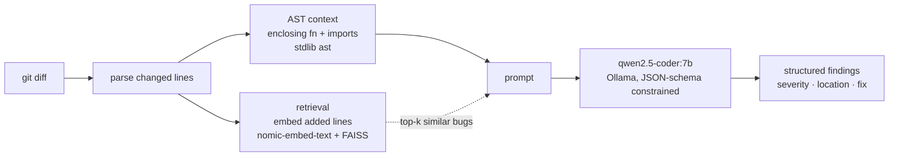

# Boogeyman: an explainable local LLM code reviewer, and an honest test of retrieval

## Motivation

Can a small, fully-local code LLM do useful code review on a laptop — and does the
common trick of **retrieving similar past bugs into the prompt (RAG)** actually help?
Boogeyman is built to answer the second question honestly, with a benchmark whose
ground truth is unambiguous, rather than to demo cherry-picked wins.

Everything runs on-device (Apple M4 / 16 GB), `$0`, open models only.

## Architecture

- **AST context** (`src/boogeyman/context.py`): a 3-line diff window hides bugs whose
  cause is elsewhere in the function, so we attach the whole enclosing function and the
  file's imports. Python-only via the standard-library `ast` module (exact line spans,
  zero dependencies); Tree-sitter is the documented swap-in for multi-language.
- **Retrieval** (`src/boogeyman/retrieval/`): the added lines are embedded with
  `nomic-embed-text`; a FAISS `IndexFlatIP` (cosine) returns the top-3 nearest bug
  exemplars, injected as reference. The exemplar corpus is **disjoint** from the
  benchmark code (same bug classes, different snippets) so we test generalization.
- **Reviewer** (`src/boogeyman/llm.py`): `qwen2.5-coder:7b` via Ollama, output
  constrained to a Pydantic JSON schema at `temperature=0`.

## Evaluation: mutation-based paired benchmark

Scoring free-text reviews against real bug-fix commits is ambiguous (if the model
flags 8 issues and the commit fixed 1, are the other 7 false positives or bugs the
author missed? — unanswerable). So we manufacture perfect ground truth:

1. **Mutate** clean, correct code by injecting exactly one bug with a known operator
   (comparator flip, off-by-one, drop-guard, swap-args, invert-bool). We broke it, so
   we know the exact buggy line. Operators are token-aware (`tokenize`) so they never
   mutate inside strings/comments.
2. **Two reviews per mutant.** The *buggy* diff (clean→mutant) should flag the mutated
   line → **recall**. The *fix* diff (mutant→clean) is a correct change; any finding
   there is a true **false positive** → **precision / FPR** with no ambiguity.

## Results

`qwen2.5-coder:7b`, 15 mutants, AST context on. Same mutants both configs; only
retrieval changes.

| Metric | Baseline (LLM + context) | + Retrieval | Delta |
|---|---|---|---|
| Recall | 40% (6/15) | 33% (5/15) | −7 pp |
| Precision | 38% | 29% | −9 pp |
| F1 | 0.39 | 0.31 | −0.08 |
| FPR (on correct code) | 53% | 47% | −6 pp |
| Latency / review | 4.9s | 5.4s | +0.5s |

Recall by bug class (baseline): comparator **0/6**, invert_bool 0/1, off_by_one 1/2,
drop_guard 1/1, swap_args **4/5**.

## Findings

1. **The model is blind to boundary-comparator bugs (0/6).** `<`↔`<=` flips are
   invisible in a diff, while argument swaps are caught 80% of the time. Detection is
   strongly *bug-class dependent* — an aggregate recall number alone would hide this.
2. **High false-positive rate (53%).** On correct code the reviewer invents problems
   more than half the time. This, not recall, is the main obstacle to real-world use.
3. **Retrieval hurt.** It lowered recall and precision; only FPR improved slightly, and
   `off_by_one` recall collapsed 50%→0%. Likely causes: noisy neighbors dilute the
   model's attention, injected exemplars anchor it to the *exemplar's* bug rather than
   the one under review, and cosine-similar code is not the same as "same bug here."

## Threats to validity

- Synthetic mutants may not resemble real bugs — this is a controlled lower bound; a
  real-commit sanity check is future work.
- Small corpus (15 mutants): numbers are **directional, not publication-grade**.
- Recall uses ±1-line tolerance on the reported location.

## What I'd try next

- Gate injection on a similarity threshold, or drop to k=1, or rerank — then re-run the
  identical benchmark to see whether the negative retrieval result flips.
- Expand the corpus and add ~20 real bug-fix commits for external validity.
- Target the FPR directly (calibration / abstention), since it dominates usefulness.

The point is not that the tool is impressive; it is that each claim above is
falsifiable and was measured, including the one that failed.
